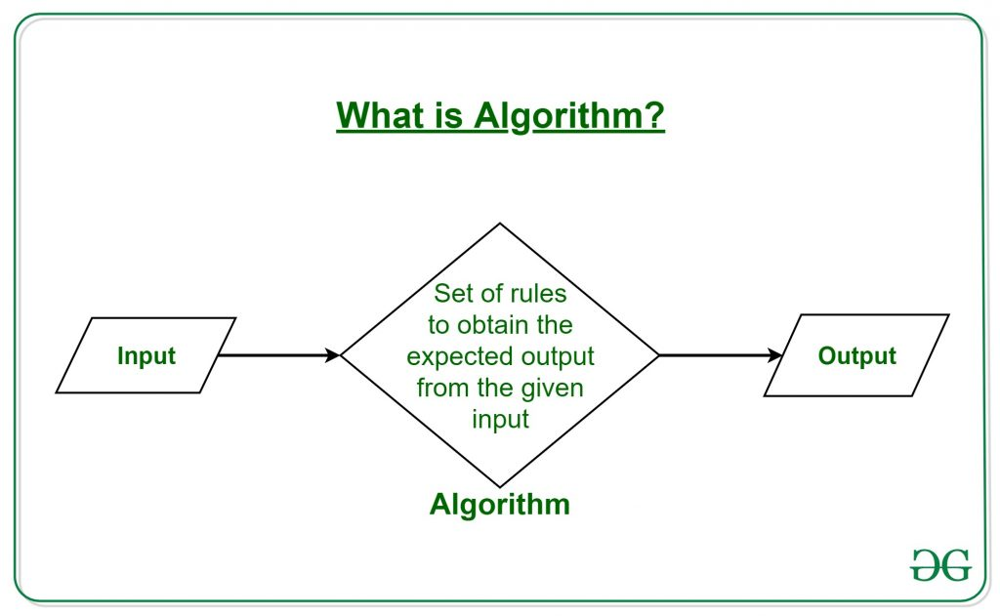
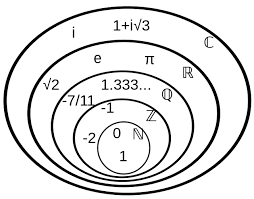
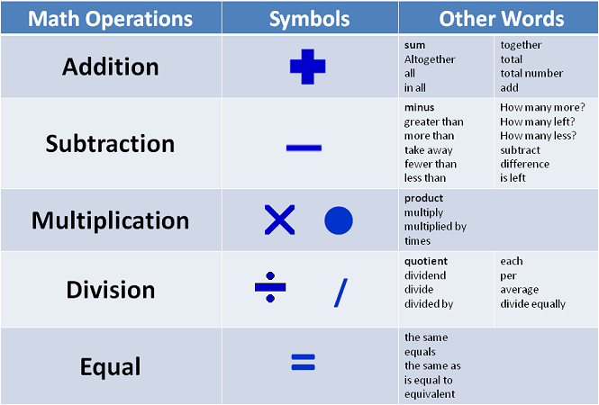
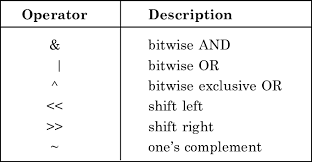

# Data-Structures-and-Algorithms
## 1. Numbers(sonlar)
### 1.1
input(data) -> algorithms -> output(data)


### 1.2. 
numbers family   


### 1.3. 
number anatomy  (number ,index, position,digits,radix)

### 1.4. 
number operations


## Decimal Representation (Base 10)
### 1.5
In decimal notation:
```
1 0
15  = 1 × 10^1 + 5 × 10^0
```

## Binary Representation (Base 2)
### 6. Binary to Decimal Conversion
| Binary  | Decimal | Expanded Form |
|---------|---------|---------------|
| 0       | 0       | 0             |
| 1       | 1       | 10^0 × 1      |
| 10      | 2       | 10^1 × 1 + 10^0 × 0 |
| 11      | 3       | 10^1 × 1 + 10^0 × 1 |
| 100     | 4       | 10^2 × 1 + 10^0 × 0 |
| 101     | 5       | 10^2 × 1 + 10^0 × 1 |
| 110     | 6       | 10^2 × 1 + 10^1 × 1 + 10^0 × 0 |
| 111     | 7       | 10^2 × 1 + 10^1 × 1 + 10^0 × 1 |

This table demonstrates how binary numbers are converted into decimal notation using powers of 10.

### 7. 
Bitwise operators  


### 7.1 Understanding Bitwise Operators

Bitwise operators are used to perform operations on binary numbers at the bit level. These operations manipulate individual bits of a number and are commonly used in low-level programming, cryptography, and performance optimizations.

### 7.2 Common Bitwise Operators

### 1. AND (`&`)
Performs a bitwise AND operation, where each bit is compared, and the result is `1` only if both corresponding bits are `1`.

#### Example:
```
  1010 (10 in decimal)
& 1100 (12 in decimal)
  ----
  1000 (8 in decimal)
```

### 2. OR (`|`)
Performs a bitwise OR operation, where each bit is compared, and the result is `1` if at least one of the corresponding bits is `1`.

#### Example:
```
  1010 (10 in decimal)
| 1100 (12 in decimal)
  ----
  1110 (14 in decimal)
```

### 3. XOR (`^`)
Performs a bitwise XOR (exclusive OR) operation, where each bit is compared, and the result is `1` if the corresponding bits are different.

#### Example:
```
  1010 (10 in decimal)
^ 1100 (12 in decimal)
  ----
  0110 (6 in decimal)
```

### 4. NOT (`~`)
Performs a bitwise NOT (1's complement) operation, flipping all bits (changing `1` to `0` and `0` to `1`).

#### Example:
```
  ~1010 (10 in decimal)
  ----
  0101 (in 4-bit representation)
  
  In two's complement representation, ~10 becomes -11.
```

### 5. Left Shift (`<<`)
Shifts the bits of a number to the left by a specified number of positions, filling the right side with `0`s. This effectively multiplies the number by `2^n`.

#### Example:
```
  1010 (10 in decimal) << 1
  ----
  10100 (20 in decimal)
```
**Visual Representation:**
```
Before:  00001010 (10 in decimal)
Shift << 1
After:   00010100 (20 in decimal)
```

### 6. Right Shift (`>>`)
Shifts the bits of a number to the right by a specified number of positions. For positive numbers, it fills the left side with `0`s.

#### Example:
```
  1010 (10 in decimal) >> 1
  ----
  101 (5 in decimal)
```
**Visual Representation:**
```
Before:  00001010 (10 in decimal)
Shift >> 1
After:   00000101 (5 in decimal)
```

These operations allow efficient manipulation of binary data and are widely used in various computing applications.

